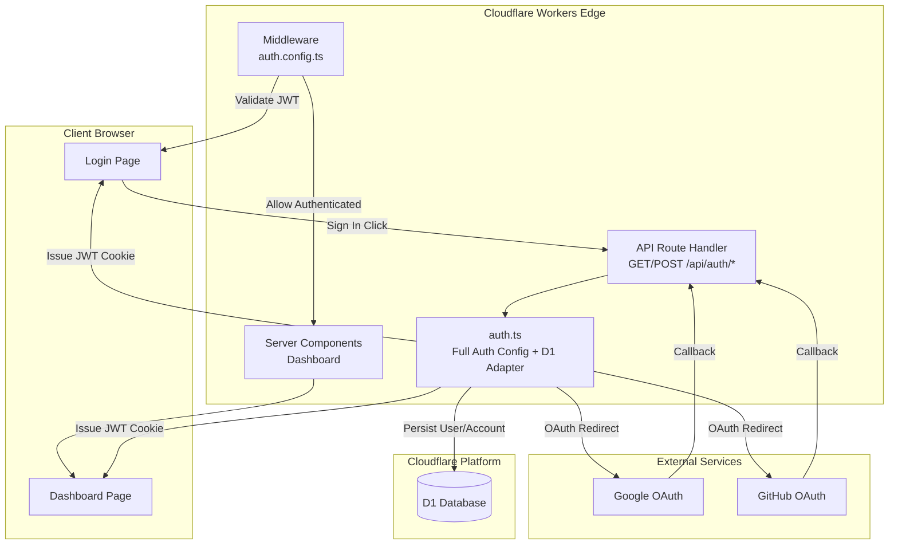
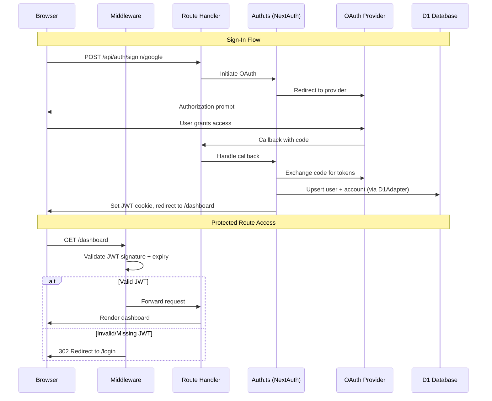
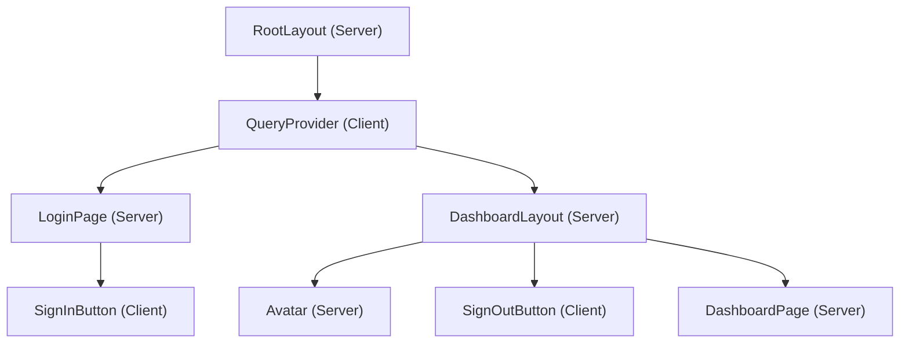

# Design Document: Auth System

## Overview

This design describes the authentication system for the Smart Document Reader application. The system uses NextAuth.js v5 (Auth.js) with OAuth providers (Google and GitHub), JWT session strategy, and Cloudflare D1 for user persistence — all running on Cloudflare Workers Edge Runtime via the OpenNext adapter.

The architecture follows a "split config" pattern: an edge-safe configuration (`auth.config.ts`) handles middleware session validation without database imports, while the full configuration (`auth.ts`) extends it with the D1 adapter for server-side route handlers that persist user data.

### Key Design Decisions

1. **JWT over database sessions**: Edge middleware cannot make database calls per request without latency penalties. JWT tokens are verified locally using cryptographic signatures.
2. **Split auth config**: Middleware runs in a restricted Edge context. Importing the D1 adapter in middleware would fail at build time. The split ensures middleware only imports edge-safe code.
3. **`getCloudflareContext()` for D1 access**: The OpenNext Cloudflare adapter provides runtime bindings via `getCloudflareContext().env.DB`, which is the standard pattern for accessing D1 in this stack.
4. **Server Components for protected pages**: The dashboard uses server-side `auth()` calls to get session data, avoiding client-side session fetching overhead.

## Architecture



### Request Flow



## Components and Interfaces

### File Structure

```
src/
├── auth.config.ts          # Edge-safe auth config (providers, JWT callbacks)
├── auth.ts                 # Full auth config (extends auth.config + D1 adapter)
├── middleware.ts           # Next.js Edge middleware (route protection)
├── app/
│   ├── layout.tsx          # Root layout (wraps with QueryProvider)
│   ├── api/
│   │   └── auth/
│   │       └── [...nextauth]/
│   │           └── route.ts  # NextAuth API route handlers
│   ├── login/
│   │   └── page.tsx        # Login page with OAuth buttons
│   └── dashboard/
│       ├── layout.tsx      # Dashboard layout (auth guard + nav)
│       └── page.tsx        # Dashboard main content
├── components/
│   ├── providers/
│   │   └── query-provider.tsx  # TanStack React Query provider
│   ├── auth/
│   │   ├── sign-in-button.tsx  # OAuth sign-in button component
│   │   └── sign-out-button.tsx # Sign-out button component
│   └── ui/
│       └── avatar.tsx      # User avatar with fallback
├── lib/
│   └── db/
│       └── schema.sql      # D1 migration SQL
```

### Module Interfaces

#### `src/auth.config.ts` (Edge-Safe)

```typescript
import type { NextAuthConfig } from "next-auth";
import Google from "next-auth/providers/google";
import GitHub from "next-auth/providers/github";

export const authConfig: NextAuthConfig = {
  providers: [Google, GitHub],
  pages: {
    signIn: "/login",
  },
  session: {
    strategy: "jwt",
    maxAge: 30 * 24 * 60 * 60, // 30 days
  },
  callbacks: {
    authorized({ auth, request: { nextUrl } }) {
      const isLoggedIn = !!auth?.user;
      const isProtected = nextUrl.pathname.startsWith("/dashboard");
      if (isProtected && !isLoggedIn) {
        return false; // Redirect to signIn page
      }
      return true;
    },
    jwt({ token, user }) {
      if (user) {
        token.id = user.id;
      }
      return token;
    },
    session({ session, token }) {
      if (token.id) {
        session.user.id = token.id as string;
      }
      return session;
    },
  },
};
```

#### `src/auth.ts` (Full Config with D1 Adapter)

```typescript
import NextAuth from "next-auth";
import { D1Adapter } from "@auth/d1-adapter";
import { getCloudflareContext } from "@opennextjs/cloudflare";
import { authConfig } from "./auth.config";

export const { handlers, auth, signIn, signOut } = NextAuth(() => {
  const { env } = getCloudflareContext();
  return {
    ...authConfig,
    adapter: D1Adapter(env.DB),
  };
});
```

#### `src/middleware.ts`

```typescript
import NextAuth from "next-auth";
import { authConfig } from "./auth.config";

const { auth } = NextAuth(authConfig);

export default auth((req) => {
  // The authorized callback in authConfig handles the logic
});

export const config = {
  matcher: [
    "/((?!_next/static|_next/image|favicon).*)",
  ],
};
```

#### `src/app/api/auth/[...nextauth]/route.ts`

```typescript
import { handlers } from "@/auth";

export const { GET, POST } = handlers;
```

#### `src/components/providers/query-provider.tsx`

```typescript
"use client";

import { QueryClient, QueryClientProvider } from "@tanstack/react-query";
import { useState } from "react";

export function QueryProvider({ children }: { children: React.ReactNode }) {
  const [queryClient] = useState(
    () =>
      new QueryClient({
        defaultOptions: {
          queries: {
            staleTime: 60 * 1000, // 60 seconds
            retry: 3,
          },
        },
      })
  );

  return (
    <QueryClientProvider client={queryClient}>{children}</QueryClientProvider>
  );
}
```

### Component Hierarchy



## Data Models

### D1 Schema (SQLite)

```sql
-- Users table: stores authenticated user profiles
CREATE TABLE IF NOT EXISTS users (
    id TEXT PRIMARY KEY,
    name TEXT,
    email TEXT,
    emailVerified TEXT,
    image TEXT
);

-- Accounts table: links OAuth providers to users
CREATE TABLE IF NOT EXISTS accounts (
    userId TEXT NOT NULL,
    type TEXT NOT NULL,
    provider TEXT NOT NULL,
    providerAccountId TEXT NOT NULL,
    refresh_token TEXT,
    access_token TEXT,
    expires_at INTEGER,
    token_type TEXT,
    scope TEXT,
    id_token TEXT,
    session_state TEXT,
    PRIMARY KEY (provider, providerAccountId),
    FOREIGN KEY (userId) REFERENCES users(id) ON DELETE CASCADE
);

-- Verification tokens: used for email verification flows
CREATE TABLE IF NOT EXISTS verification_tokens (
    identifier TEXT NOT NULL,
    token TEXT NOT NULL,
    expires TEXT NOT NULL,
    UNIQUE (identifier, token)
);
```

### JWT Token Payload Structure

```typescript
interface JWTPayload {
  id: string;        // User ID from D1
  name: string;      // Display name from OAuth provider
  email: string;     // Email from OAuth provider
  picture: string;   // Profile image URL from OAuth provider
  iat: number;       // Issued at timestamp
  exp: number;       // Expiration timestamp (max 30 days)
  jti: string;       // Unique token identifier
}
```

### Session Object (exposed to components)

```typescript
interface Session {
  user: {
    id: string;
    name?: string | null;
    email?: string | null;
    image?: string | null;
  };
  expires: string; // ISO date string
}
```

## Wrangler Configuration Update

The D1 binding must be added to `wrangler.jsonc`:

```jsonc
{
  // ... existing config
  "d1_databases": [
    {
      "binding": "DB",
      "database_name": "superbrands-auth",
      "database_id": "<generated-after-creation>"
    }
  ]
}
```


## Correctness Properties

*A property is a characteristic or behavior that should hold true across all valid executions of a system — essentially, a formal statement about what the system should do. Properties serve as the bridge between human-readable specifications and machine-verifiable correctness guarantees.*

### Property 1: Session data round-trip preservation

*For any* valid user profile containing an id, name, email, and image, passing that user through the `jwt` callback followed by the `session` callback SHALL produce a session object containing the same id, name, email, and image values.

**Validates: Requirements 1.3, 2.2**

### Property 2: Unauthenticated requests to protected routes are denied

*For any* URL path string that starts with "/dashboard" (including "/dashboard" itself, "/dashboard/settings", "/dashboard/documents/123", etc.), when the `authorized` callback receives a request with `auth` equal to null or with `auth.user` undefined, the callback SHALL return false.

**Validates: Requirements 2.4, 3.1, 3.6**

### Property 3: Authenticated requests to protected routes are allowed

*For any* URL path string that starts with "/dashboard", when the `authorized` callback receives a request with a valid `auth` object containing a non-null user, the callback SHALL return true.

**Validates: Requirements 2.3, 3.2**

### Property 4: Static asset paths are excluded from middleware interception

*For any* URL path string that starts with "/_next/static", "/_next/image", or "/favicon", the middleware matcher pattern SHALL NOT match that path (i.e., the path is excluded from middleware processing).

**Validates: Requirements 3.5**

### Property 5: User display name truncation

*For any* user name string of arbitrary length, the dashboard navigation SHALL display at most 50 characters of that name.

**Validates: Requirements 7.1**

### Property 6: Name fallback to email

*For any* user session where the name field is null or undefined, the dashboard SHALL display the user's email address in place of the display name in both the navigation bar and the welcome message.

**Validates: Requirements 7.6**

## Error Handling

### OAuth Provider Errors

| Error Scenario | Handling Strategy |
|---|---|
| OAuth provider returns error | Redirect to `/login?error=OAuthCallbackError` |
| OAuth provider is unreachable | NextAuth handles timeout, redirects to `/login?error=OAuthCallbackError` |
| User denies OAuth consent | Redirect to `/login?error=AccessDenied` |

### Database Errors

| Error Scenario | Handling Strategy |
|---|---|
| D1 binding unavailable | Return error response from auth handler; do not crash Worker |
| D1 write fails (user creation) | Redirect to `/login?error=DatabaseError` |
| D1 read fails (user lookup) | Redirect to `/login?error=DatabaseError` |

### Session/JWT Errors

| Error Scenario | Handling Strategy |
|---|---|
| JWT signature invalid | Middleware treats as unauthenticated → redirect to `/login` |
| JWT expired (>30 days) | Middleware treats as unauthenticated → redirect to `/login` |
| JWT malformed/unparseable | Middleware treats as unauthenticated → redirect to `/login` |
| AUTH_SECRET missing | NextAuth fails to initialize; no tokens issued or validated |

### Client-Side Error States

| Error Scenario | Handling Strategy |
|---|---|
| Login page receives `?error` param | Display generic "Sign-in failed" message |
| Session fetch fails in component | Show unauthenticated state, redirect to login |
| Profile image fails to load | Display fallback avatar (initials or generic icon) |

### Error Display on Login Page

The login page checks for an `error` query parameter and displays a dismissible error banner:

```typescript
// Simplified error handling in login page
const searchParams = await props.searchParams;
const error = searchParams?.error;

// Display: "Something went wrong. Please try again."
// Generic message regardless of error type (security best practice)
```

## Testing Strategy

### Unit Tests (Example-Based)

Unit tests cover specific scenarios, UI rendering, and configuration checks:

- **Auth config structure**: Verify `authConfig` has correct providers, session strategy, and callbacks
- **Login page rendering**: Verify OAuth buttons render with correct text and order
- **Dashboard rendering**: Verify navigation bar elements, welcome message format
- **Error state rendering**: Verify error banner appears with `?error` query param
- **Fallback avatar**: Verify avatar placeholder renders when image is null
- **QueryProvider stability**: Verify QueryClient is instantiated via useState

### Property-Based Tests

Property tests validate universal behaviors using [fast-check](https://github.com/dubzzz/fast-check) (the standard PBT library for TypeScript/JavaScript):

- **Property 1**: Generate random user profiles (arbitrary strings for id, name, email, image URLs), pass through jwt→session callbacks, assert all fields preserved
- **Property 2**: Generate random path strings prefixed with "/dashboard" + random suffixes, call authorized with null auth, assert returns false
- **Property 3**: Generate random path strings prefixed with "/dashboard" + random suffixes, call authorized with valid auth object, assert returns true
- **Property 4**: Generate random path strings prefixed with "/_next/static", "/_next/image", or "/favicon" + random suffixes, test against middleware matcher regex, assert no match
- **Property 5**: Generate random strings of length 0-200, pass through name truncation logic, assert output length ≤ 50
- **Property 6**: Generate random email strings, create session with null name, verify email is used as display text

**Configuration:**
- Library: `fast-check`
- Minimum iterations: 100 per property
- Tag format: `Feature: auth-system, Property {N}: {description}`

### Integration Tests

Integration tests verify the system works end-to-end with real (or emulated) Cloudflare services:

- **D1 user persistence**: Create user via adapter, verify record in D1
- **D1 account linking**: Link OAuth account, verify foreign key relationship
- **D1 duplicate prevention**: Authenticate same user twice, verify single user record
- **OAuth callback flow**: Mock OAuth provider response, verify JWT cookie is set
- **Build compatibility**: Run `opennextjs-cloudflare build`, verify no Edge Runtime errors

### Smoke Tests

- Auth config uses JWT strategy
- AUTH_SECRET is required (NextAuth fails without it)
- D1 migration SQL creates all required tables with correct constraints
- Middleware only imports from `auth.config.ts`
- `auth.ts` exports `handlers`, `auth`, `signIn`, `signOut`
