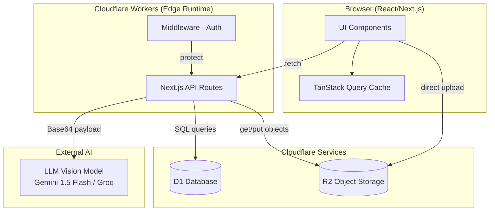
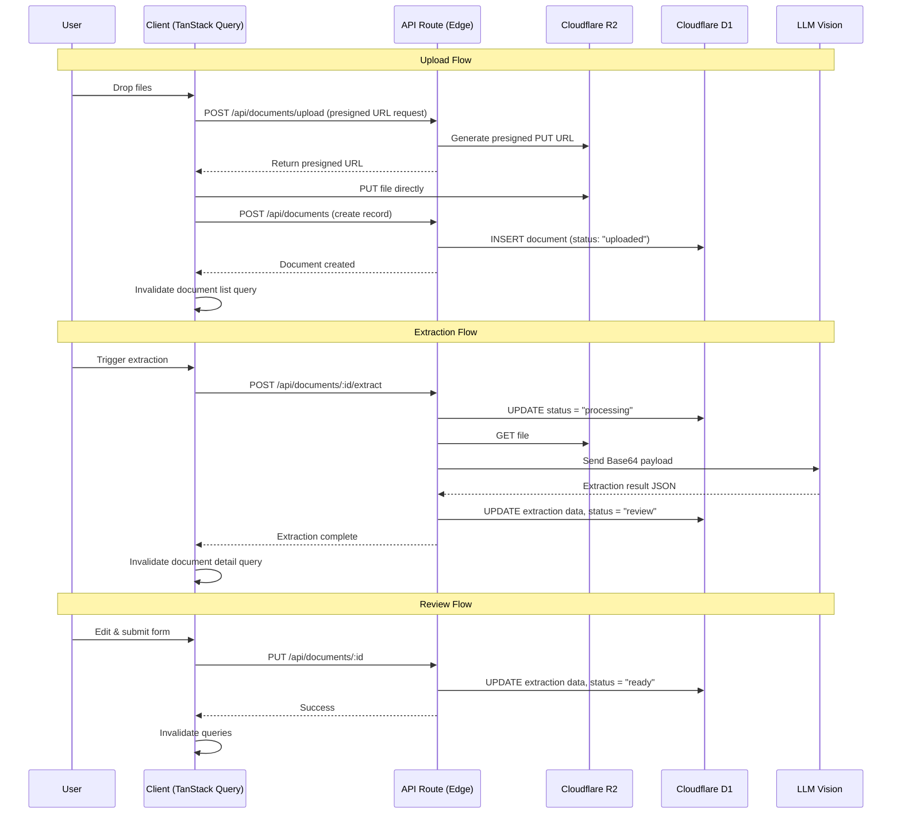

# Design Document: Smart Document Reader

## Overview

Smart Document Reader is a web application that enables users to upload financial documents (invoices, receipts, bills), extract structured data using AI Vision models, review and correct the extracted data, and export finalized results as CSV. The system follows a four-stage workflow: **Upload → Processing → Review → Ready**.

The application is built on Next.js App Router deployed to Cloudflare via OpenNext, using Cloudflare D1 for persistence, Cloudflare R2 for file storage, TanStack Query v5 for client-side state management, and a free LLM Vision model (Gemini 1.5 Flash or Groq) for OCR extraction.

### Key Design Decisions

1. **Edge-first architecture**: All API routes run on Cloudflare Workers edge runtime, keeping latency low and leveraging Cloudflare bindings for D1/R2 access.
2. **Client-side orchestration**: TanStack Query manages all server state, cache invalidation, and optimistic UI updates. No server-side state beyond the database.
3. **Graceful degradation on AI failure**: If AI extraction fails, the system still transitions to "review" with empty fields, allowing manual entry.
4. **CSV generation on the client**: Export is performed client-side from cached query data to avoid additional server round-trips for filtered results.

## Architecture



### Request Flow



### File Upload Strategy

Files are uploaded directly to R2 using presigned URLs to avoid passing large payloads through the Worker (which has a 100MB request body limit but benefits from direct R2 upload for performance). The flow:

1. Client requests a presigned PUT URL from the API route
2. API route generates a presigned URL using the S3-compatible R2 API
3. Client uploads directly to R2, tracking progress via XMLHttpRequest
4. On completion, client notifies the API to create the database record

## Components and Interfaces

### API Routes

| Route | Method | Purpose |
|-------|--------|---------|
| `/api/documents` | GET | List documents with filters (status, vendor, date range) |
| `/api/documents` | POST | Create document record after upload |
| `/api/documents/upload` | POST | Generate presigned R2 upload URL |
| `/api/documents/[id]` | GET | Get single document with extraction data |
| `/api/documents/[id]` | PUT | Update document (review submission) |
| `/api/documents/[id]/extract` | POST | Trigger AI extraction |

### Client Components

| Component | Location | Responsibility |
|-----------|----------|----------------|
| `QueryProvider` | `src/components/providers/query-provider.tsx` | Existing - wraps app with QueryClientProvider |
| `UploadHandler` | `src/components/documents/upload-handler.tsx` | Drag-and-drop multi-file upload with progress |
| `ReviewForm` | `src/components/documents/review-form.tsx` | Editable form for extraction results with confidence indicators |
| `Dashboard` | `src/app/dashboard/documents/page.tsx` | Document list table with filters and export |
| `DocumentStatusBadge` | `src/components/documents/status-badge.tsx` | Visual status indicator |
| `ConfidenceIndicator` | `src/components/documents/confidence-indicator.tsx` | Visual confidence score display |
| `ItemsTable` | `src/components/documents/items-table.tsx` | Editable line items table |
| `CsvExporter` | `src/lib/csv-export.ts` | Client-side CSV generation and download |

### TanStack Query Hooks

| Hook | File | Purpose |
|------|------|---------|
| `useDocuments` | `src/hooks/use-documents.ts` | Fetch document list with filters |
| `useDocument` | `src/hooks/use-document.ts` | Fetch single document detail |
| `useUploadDocument` | `src/hooks/use-upload-document.ts` | Mutation for file upload flow |
| `useExtractDocument` | `src/hooks/use-extract-document.ts` | Mutation to trigger AI extraction |
| `useSubmitReview` | `src/hooks/use-submit-review.ts` | Mutation for review form submission |

### Query Keys

```typescript
export const documentKeys = {
  all: ['documents'] as const,
  lists: () => [...documentKeys.all, 'list'] as const,
  list: (filters: DocumentFilters) => [...documentKeys.lists(), filters] as const,
  details: () => [...documentKeys.all, 'detail'] as const,
  detail: (id: number) => [...documentKeys.details(), id] as const,
};
```

### Interfaces

```typescript
// Document status lifecycle
type DocumentStatus = 'uploaded' | 'processing' | 'review' | 'ready';

// Confidence scores for each top-level field
interface ConfidenceScores {
  vendor_name: number; // 0.0 - 1.0
  date: number;
  total: number;
  currency: number;
  items: number;
}

// Individual line item
interface ExtractedItem {
  id?: number;
  description: string;    // 1-500 chars
  quantity: number;       // 0.01 - 999,999.99
  unit_price: number;    // 0.00 - 999,999,999.99
  amount: number;        // 0.00 - 999,999,999.99
}

// Full extraction result
interface ExtractionResult {
  vendor_name: string | null;  // 1-200 chars
  date: string | null;         // ISO 8601 YYYY-MM-DD
  total: number | null;        // 0.00 - 999,999,999.99
  currency: string | null;     // ISO 4217 (3 uppercase letters)
  items: ExtractedItem[];      // 0-100 items
  confidence_scores: ConfidenceScores;
}

// Document record from database
interface Document {
  id: number;
  file_name: string;
  r2_key: string;
  status: DocumentStatus;
  vendor_name: string | null;
  date: string | null;
  total: number | null;
  currency: string | null;
  confidence_scores: ConfidenceScores | null;
  created_at: string;
  updated_at: string;
  items?: ExtractedItem[];
}

// Filters for document list
interface DocumentFilters {
  statuses?: DocumentStatus[];
  vendor_name?: string;
  date_from?: string;
  date_to?: string;
}

// Upload presigned URL response
interface PresignedUploadResponse {
  url: string;
  r2_key: string;
}

// Review form submission payload
interface ReviewSubmission {
  vendor_name: string;
  date: string;
  total: number;
  currency: string;
  items: ExtractedItem[];
}
```

## Data Models

### Database Schema

```sql
-- Documents table: stores document metadata and extraction results
CREATE TABLE IF NOT EXISTS documents (
    id INTEGER PRIMARY KEY AUTOINCREMENT,
    file_name TEXT NOT NULL CHECK(length(file_name) <= 255),
    r2_key TEXT NOT NULL CHECK(length(r2_key) <= 512),
    status TEXT NOT NULL CHECK(status IN ('uploaded', 'processing', 'review', 'ready')),
    vendor_name TEXT CHECK(vendor_name IS NULL OR length(vendor_name) <= 255),
    date TEXT CHECK(date IS NULL OR date GLOB '[0-9][0-9][0-9][0-9]-[0-1][0-9]-[0-3][0-9]'),
    total REAL CHECK(total IS NULL OR (total >= 0 AND total <= 999999999.99)),
    currency TEXT CHECK(currency IS NULL OR (length(currency) = 3 AND currency GLOB '[A-Z][A-Z][A-Z]')),
    confidence_scores TEXT, -- JSON string of ConfidenceScores
    created_at TEXT NOT NULL DEFAULT (strftime('%Y-%m-%dT%H:%M:%SZ', 'now')),
    updated_at TEXT NOT NULL DEFAULT (strftime('%Y-%m-%dT%H:%M:%SZ', 'now'))
);

-- Extracted items table: stores line items from extraction
CREATE TABLE IF NOT EXISTS extracted_items (
    id INTEGER PRIMARY KEY AUTOINCREMENT,
    document_id INTEGER NOT NULL,
    description TEXT CHECK(description IS NULL OR length(description) <= 500),
    quantity REAL CHECK(quantity IS NULL OR quantity >= 0),
    unit_price REAL,
    amount REAL,
    FOREIGN KEY (document_id) REFERENCES documents(id) ON DELETE CASCADE
);

-- Indexes for dashboard filtering and sorting
CREATE INDEX IF NOT EXISTS idx_documents_status ON documents(status);
CREATE INDEX IF NOT EXISTS idx_documents_vendor_name ON documents(vendor_name);
CREATE INDEX IF NOT EXISTS idx_documents_date ON documents(date);
CREATE INDEX IF NOT EXISTS idx_documents_created_at ON documents(created_at);
CREATE INDEX IF NOT EXISTS idx_extracted_items_document_id ON extracted_items(document_id);
```

### R2 Object Key Structure

```
documents/{document_id}/{original_filename}
```

Example: `documents/42/invoice-2024-01.pdf`

### AI Prompt Structure

The LLM Vision model receives a structured prompt requesting JSON output:

```
Extract financial data from this document image. Return a JSON object with:
- vendor_name: string (company/vendor name)
- date: string (date in YYYY-MM-DD format)
- total: number (total amount)
- currency: string (3-letter ISO 4217 currency code)
- items: array of {description, quantity, unit_price, amount}
- confidence_scores: {vendor_name, date, total, currency, items} (each 0.0-1.0)

Return ONLY valid JSON, no markdown or explanation.
```

### CSV Export Format

```csv
file_name,vendor_name,date,total,currency,item_count
"Invoice 001.pdf","Acme Corp","2024-01-15",1250.00,"USD",5
"Receipt.png","Store, Inc.","2024-01-16",89.99,"EUR",2
```

Fields containing commas, double quotes, or newlines are enclosed in double quotes. Embedded double quotes are escaped by doubling (`""`).


## Correctness Properties

*A property is a characteristic or behavior that should hold true across all valid executions of a system—essentially, a formal statement about what the system should do. Properties serve as the bridge between human-readable specifications and machine-verifiable correctness guarantees.*

### Property 1: File validation accepts only valid MIME types and sizes

*For any* file with a given MIME type and size, the file validation function SHALL accept the file if and only if the MIME type is one of (image/png, image/jpeg, image/webp, application/pdf) AND the file size is less than or equal to 10 MB (10,485,760 bytes). All other combinations SHALL be rejected.

**Validates: Requirements 1.5, 1.6, 1.7**

### Property 2: ExtractionResult schema validation

*For any* ExtractionResult object, all fields SHALL satisfy their constraints: vendor_name is null or 1–200 characters, date is null or matches YYYY-MM-DD format, total is null or between 0.00 and 999,999,999.99, currency is null or exactly 3 uppercase letters, items contains 0–100 items each with description (1–500 chars), quantity (0.01–999,999.99), unit_price (0.00–999,999,999.99), and amount (0.00–999,999,999.99), and each confidence score is between 0.0 and 1.0 inclusive.

**Validates: Requirements 3.1, 3.2**

### Property 3: ExtractionResult serialization round-trip

*For any* valid ExtractionResult object, serializing it to JSON and parsing it back SHALL produce a structurally identical object with the same field names, types, and values.

**Validates: Requirements 3.4**

### Property 4: LLM response parsing produces valid ExtractionResult

*For any* valid JSON string conforming to the expected LLM response schema, the parsing function SHALL produce an ExtractionResult object that passes schema validation (Property 2).

**Validates: Requirements 2.3**

### Property 5: Confidence threshold classification

*For any* numeric confidence score between 0.0 and 1.0, the confidence classification function SHALL return "low confidence" (highlight) if and only if the score is strictly less than 0.7, and "normal" (no highlight) otherwise.

**Validates: Requirements 4.2, 4.3**

### Property 6: Review form validation correctness

*For any* form submission data, the validation function SHALL accept the submission if and only if: vendor_name is a non-empty, non-whitespace-only string; date is a valid ISO 8601 date string (YYYY-MM-DD); total is a numeric value greater than or equal to 0; and currency is a valid 3-letter uppercase ISO 4217 code. All other submissions SHALL be rejected with appropriate error indicators.

**Validates: Requirements 4.5, 4.6**

### Property 7: Document filter correctness

*For any* list of documents and any combination of filters (status set, vendor name substring, date range), the filter function SHALL return exactly those documents where: the document's status is in the selected status set (or all if no filter), the document's vendor_name contains the search string case-insensitively (or all if no filter), and the document's created_at falls within the date range (or all if no filter).

**Validates: Requirements 5.3, 5.4, 5.5**

### Property 8: CSV generation round-trip

*For any* array of document objects with arbitrary string values (including commas, double quotes, and newlines), generating a CSV string and parsing it back SHALL yield the original field values for each document. The CSV SHALL have a header row as the first row, one data row per document, and fields containing special characters SHALL be properly escaped.

**Validates: Requirements 6.2, 6.3, 6.5**

## Error Handling

### Error Categories and Responses

| Error Type | Source | User-Facing Response | Technical Response |
|-----------|--------|---------------------|-------------------|
| File validation error | Client | Inline error per file (format/size) | Prevent upload, no network call |
| R2 upload failure | Network/R2 | Per-file error with retry button (max 3) | Log to console, preserve other uploads |
| AI extraction timeout | LLM API | Notification: "Extraction failed" | Set status to "review", empty result |
| AI extraction parse error | LLM API | Same as timeout | Same as timeout |
| D1 unreachable | Database | Connection error with retry (3x, 2s delay) | Log error type and component |
| Form submission failure | Database | "Save failed" with retry option | Preserve form data, log error |
| Query failure | Network | Inline error after 3 retries | TanStack Query retry with backoff |
| Mutation failure | Network | Inline error, no auto-retry | Disable button during pending |
| CSV generation failure | Client | "Export could not be completed" | Log error, no file download |

### Error Handling Principles

1. **Never crash the application**: All errors are caught and rendered inline without requiring page reload.
2. **Preserve user work**: Form data and successful uploads are never lost due to unrelated failures.
3. **No sensitive data in UI**: Stack traces, server addresses, and internal IDs are logged to console only.
4. **Graceful degradation**: AI failure still allows manual data entry via the review form.
5. **Bounded retries**: Maximum 3 retry attempts for any operation, with clear messaging when exhausted.

### Retry Strategy

```typescript
// TanStack Query retry configuration
const queryClient = new QueryClient({
  defaultOptions: {
    queries: {
      staleTime: 30 * 1000, // 30 seconds
      retry: 3,
      retryDelay: (attemptIndex) => Math.min(1000 * 2 ** attemptIndex, 10000),
    },
    mutations: {
      retry: false, // No auto-retry for mutations
    },
  },
});
```

### Error Boundary Strategy

- React Error Boundaries wrap major sections (Upload, Dashboard, Review) to prevent cascading failures.
- Each boundary renders a fallback UI with a "Try Again" action.
- Errors are logged with component origin for debugging.

## Testing Strategy

### Testing Framework

- **Unit & Property Tests**: Vitest + fast-check (already configured in the project)
- **Component Tests**: Vitest with React Testing Library
- **Integration Tests**: Vitest with mocked Cloudflare bindings

### Property-Based Tests (fast-check)

Each correctness property maps to a property-based test with minimum 100 iterations:

| Property | Test File | What It Tests |
|----------|-----------|---------------|
| Property 1: File validation | `src/__tests__/file-validation.property.test.ts` | `validateFile()` function |
| Property 2: Schema validation | `src/__tests__/extraction-result.property.test.ts` | `validateExtractionResult()` function |
| Property 3: Serialization round-trip | `src/__tests__/extraction-result.property.test.ts` | JSON serialize/parse cycle |
| Property 4: LLM response parsing | `src/__tests__/llm-parser.property.test.ts` | `parseLLMResponse()` function |
| Property 5: Confidence threshold | `src/__tests__/confidence-threshold.property.test.ts` | `getConfidenceLevel()` function |
| Property 6: Form validation | `src/__tests__/review-validation.property.test.ts` | `validateReviewForm()` function |
| Property 7: Document filtering | `src/__tests__/document-filter.property.test.ts` | `filterDocuments()` function |
| Property 8: CSV round-trip | `src/__tests__/csv-export.property.test.ts` | `generateCsv()` + parse cycle |

**Configuration**: Each test uses `{ numRuns: 100 }` and is tagged with:
```
Feature: smart-document-reader, Property {N}: {property_text}
```

### Unit Tests (Example-Based)

| Area | Test File | Coverage |
|------|-----------|----------|
| Upload component | `src/__tests__/upload-handler.test.tsx` | Drag-drop interaction, progress display, batch limit |
| Review form | `src/__tests__/review-form.test.tsx` | Field rendering, error display, submission flow |
| Dashboard | `src/__tests__/dashboard.test.tsx` | Table rendering, empty states, loading states |
| API routes | `src/__tests__/api/documents.test.ts` | CRUD operations, status transitions |
| Error handling | `src/__tests__/error-handling.test.ts` | Retry exhaustion, error messages |

### Integration Tests

| Area | Test File | Coverage |
|------|-----------|----------|
| Upload flow | `src/__tests__/integration/upload-flow.test.ts` | R2 presigned URL → upload → DB record |
| Extraction flow | `src/__tests__/integration/extraction-flow.test.ts` | Status transitions, AI call, result storage |
| Review flow | `src/__tests__/integration/review-flow.test.ts` | Form submit → DB update → status change |

### Test Execution

```bash
# Run all tests (single execution, no watch mode)
npm run test

# Run only property tests
npx vitest --run src/__tests__/*.property.test.ts
```
